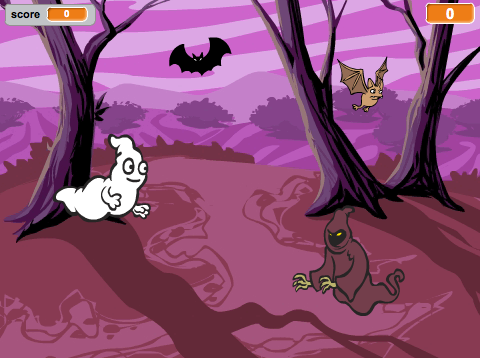

# Introduction { .intro }

You are going to make a ghost-catching game!

  <iframe allowtransparency="true" width="485" height="402" src="https://scratch.mit.edu/projects/embed/60787262/?autostart=false" frameborder="0"></iframe>
  

# Step 1: Animating a ghost

## Activity Checklist

[[[new-scratch-project]]]

+ Add in a new ghost sprite, and a suitable stage backdrop.

	

+ Would the following be better as hyperlinks, rather than additional inline content?

[[[add-sprite-from-library]]]

[[[backdrop-from-library]]]

+ Add code to your ghost, so that it repeatedly appears and disappears.

### Hint 1
{: .hint-heading #hint-1 }
Once the __green flag is clicked__, you'll need to make your ghost __hide for 1 second__ and then __show for 1 second__. It will need to repeat this __forever__.
{: .hint-content .hint-1 }

### Hint 2
{: .hint-heading #hint-2 }
Here are the code blocks you'll need:

{: .hint-content .hint-2 }

### Hint 3
{: .hint-heading #hint-3 }
Here's how your code should look:

{: .hint-content .hint-3 }

+ Test out your ghost's code, by clicking the green flag. Should this be a mini-project, dealing with testing, debugging, etc.? Also, where should these test steps go? It seems silly to put them here, in the step _after_ the code has been written.

## Save your project

[[[saving-scratch]]]

# Step 2: Random ghosts

Your ghost is really easy to catch, because it doesn't move!

## Activity Checklist

+ Instead of staying in the same position, can you code your ghost to appear in random positions on the screen?

### Hint 1
{: .hint-heading #hint-1 }
You want your ghost to __go to__ a random position on the stage before appearing each time.
{: .hint-content .hint-1 }

### Hint 2
{: .hint-heading #hint-2 }
You could use either of these code blocks:
Either:

Or:

{: .hint-content .hint-2 }

### Hint 3
{: .hint-heading #hint-3 }
Here's how your code should look:
Either:

Or:

{: .hint-content .hint-3 }

+ Test our your ghost again, and you should notice that it appears in a different place each time.

## Save your project

[[[saving-scratch]]]

## Challenge: More randomness
Can you make your ghost `wait` a random amount of time before appearing? Can you use the `set size` {.blocklooks} block to make your ghost a random size each time it appears?

## Save your project

[[[saving-scratch]]]

# Step 3: Catching ghosts

Lets allow the player to catch ghosts!

## Activity Checklist

+ Can you make your ghost disappear when it's been caught?

### Hint 1
{: .hint-heading #hint-1 }
__When clicked__, your ghost sprite should hide.
{: .hint-content .hint-1 }

### Hint 2
{: .hint-heading #hint-2 }
Here are the code blocks you should use: ...[todo]
{: .hint-content .hint-2 }

### Hint 3
{: .hint-heading #hint-3 }
Here's how your code should look: ...[todo]
{: .hint-content .hint-3 }

+ Test out your project. Can you catch ghosts as they appear? If you find it difficult to catch the ghosts, you can play the game in fullscreen mode by clicking this button:

	

## Challenge: Adding a sound
Can you make a sound each time a ghost is caught?

## Save your project

[[[saving-scratch]]]

# Step 4: Adding a score

Let's make things more interesting by keeping score.

## Activity Checklist

[[[keeping-score]]]

+ Can you keep track of the player's score? Player's should score points by clicking on ghosts to catch them.

### Hint 1
{: .hint-heading #hint-1 }
__When the green flag is clicked__ a score __variable__[link??] should be set to 0. __When the ghost sprite is clicked__, the __score__ should be changed by 1.
{: .hint-content .hint-1 }

### Hint 2
{: .hint-heading #hint-2 }
Here are the code blocks you will need to use: ...[todo]
{: .hint-content .hint-2 }

### Hint 3
{: .hint-heading #hint-3 }
[Is this where the link to the 'keeping-score' mini-project goes? If so, will this be specific enough for this (and all other) tasks?]
{: .hint-content .hint-3 }

## Save your project

[[[saving-scratch]]]

# Step 5: Adding a timer

## Activity Checklist { .check }

+ Can make your game more interesting, by only giving your player 10 seconds to catch as many ghosts as possible?

	Add the timer to the __stage__. This is how the timer should work:

	+ The timer should start at 10 seconds;
	+ The timer should count down every second;
	+ The game should stop when the timer gets to 0.

### Hint 1
{: .hint-heading #hint-1 }
__When the green flag is clicked__ a time __variable__[link??] should be set to 10. It should then __change by -1__ every second __until__ it reaches 0.
{: .hint-content .hint-1 }

### Hint 2
{: .hint-heading #hint-2 }
Here are the code blocks you will need to use: ...[todo]
{: .hint-content .hint-2 }

### Hint 3
{: .hint-heading #hint-3 }
[Is this where the link to the 'scratch-timer' mini-project goes? If so, will this be specific enough for this (and all other) tasks?]
{: .hint-content .hint-3 }

+ Ask a friend to test your game. How many points can they score? If your game is too easy, you can:

	+ Give the player less time;
	+ Make the ghosts appear less often;
	+ Make the ghosts smaller.

	Test your game a few times until you're happy that it's the right level of difficulty.

## Save your project

[[[saving-scratch]]]

## Challenge: More objects
Can you add in other objects to your game?

You'll need to think about the objects you're adding. Think about:

+ How big is it?
+ Will it appear more or less often than the ghosts?
+ What will it look/sound like when it has been caught?
+ How many points will you score (or lose) for catching it?

If you need help adding another object, you can reuse the steps above!

## Save your project

[[[saving-scratch]]]
